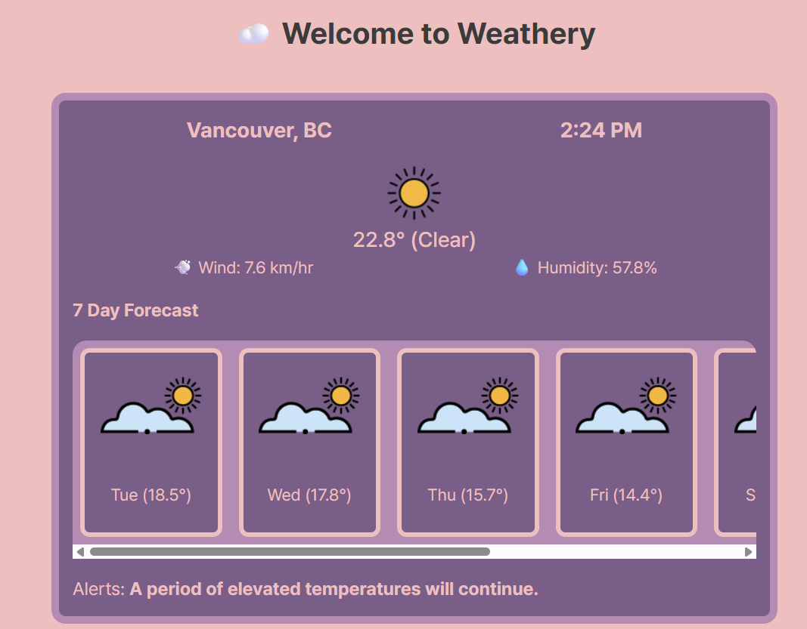
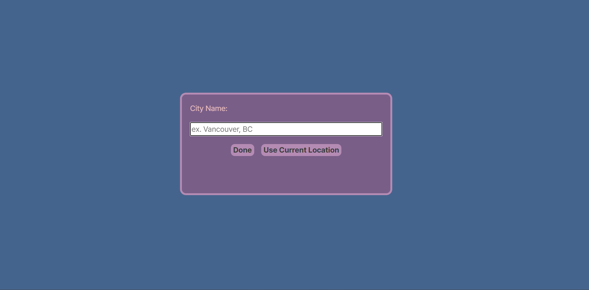

# ☁️ Weathery

A weather application that gets real-time data using the Visual Crossing Weather API using just vanilla JavaScript, HTML, and CSS. This project showcases my ability to work with APIs and manage async operations. 

## 🔍 Features

- **Live Weather Data**: Shows current temperature, conditions, humidity, and wind speed.
- **Geolocation Support**: Retrieves the user's current location once permissions are granted.
- **Reverse Geocoding**: Displays more readable location names using OpenStreetMap's Nominatim API.
- **Manual Search**: Users can search for weather data in any city.
- **Live Clock**: Automatically updates based on the location's timezone without needing to refresh the page.
- **Weather Alerts**: Highlights any active weather warnings.

## 🛠️ Tools Used

- **JavaScript**
- **HTML + CSS**
- **Visual Crossing Weather API**
- **OpenStreetMap (Nominatim Reverse Geocoding)**
- **date-fns-tz** (for timezone handling and clean formatting)

## ❓ Why I Built This

I simply wanted to use an application in my day-to-day life where I could check the weather. This project helped me:

- Deepen my understanding of `async/await`, Promises, and API handling
- Improve code organization through modular class-based architecture
- Build for real-world use cases and responsive layouts
  
## 🚧 Potential Improvements

- Save search history
- Improved error handling for failed fetches or invalid inputs
- Auto-suggestions with a world cities API
- Dark mode toggle
- **Add a loading screen whenever an async operation happens!!!!!**
  - Clicking "Use Current Location" takes a while to load, and it doesn't actually have any live feedback or loading screen
  
## 🖼️ Screenshots

